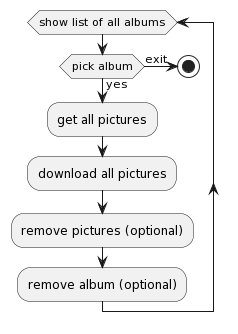

# Project name

This small library aims to automatize download and management of your personal
albums from google photos, instead of using the google photos app.

## User Experience

A cli tool that allows you to download your images from a specific album from
google photos, delete photos and remove album. Last 2 steps must be optional, so
they can be skipped.

## Requirements

TDB what is needed to connect to google photos api.

## Description

To automatize the download of your personal albums from google photos, instead
of using the google photos app. Requires to build a cli tool using google photos
api to manage your albums. The cli tool must be able to:

- Get all the albums from your google photos account.
- Pick one album.
- Download all the images from that album.
- Delete all the images from that album (this step can be skipped).
- Delete the album (this step can be skipped).
- Repeat loop.

If you want to go the extra mile, you can add a feature to
send the album title as a parameter to the cli tool, so it can be run against
that album in particular.

## Getting started

For this project, you will need to have [pip](https://pip.pypa.io/en/stable/)
and [poetry](https://python-poetry.org/) installed. Please install in your
machine using the instructions provided in the links.

### poetry

If you are new to poetry, see below some of the most used commands:

- `poetry --help`: to see all the commands available
- `poetry init`: to create a new project
- `poetry install`: to install all the dependencies
- `poetry add <package_name>`: to add a new package to the project
- `poetry remove <package_name>`: to remove a package from the project
- `poetry run <command>`: to run a command inside the virtual environment
- `poetry shell`: to enter inside the virtual environment

## Flows

Flows are available in the [flows](./flows) folder.

See below the flow proposed for this project:

NOTE: Optional steps are not yet implemented, mainly because currently google
api doesn't provide them.

## Contribution

Use [conventional commit](https://www.conventionalcommits.org/en/v1.0.0/) to
your commit messages.

Use Trunk-based as branching model for development of this project.

Project includes a.pre-commit-config.yaml to run automatic tools to review code.

## Testing

Unit testing and functional testing are available.

- `poetry run pytest` -> run all tests.
- `poetry run pytest -m unit` -> run unit tests.
- `poetry run pytest -m functional` -> run functional tests.

## Security

Secrets and variables are stored in `src/config.py` file. This file is not
included in the repository.

- DEFAULT_DOWNLOAD_PATH: str, path to download images
- MOCK_PHOTOS_LIBRARY: bool, True to mock google photos library, False to use
  google photos library.

Oauth file tokens are in oauth folder. This folder is not included in the
repository.
